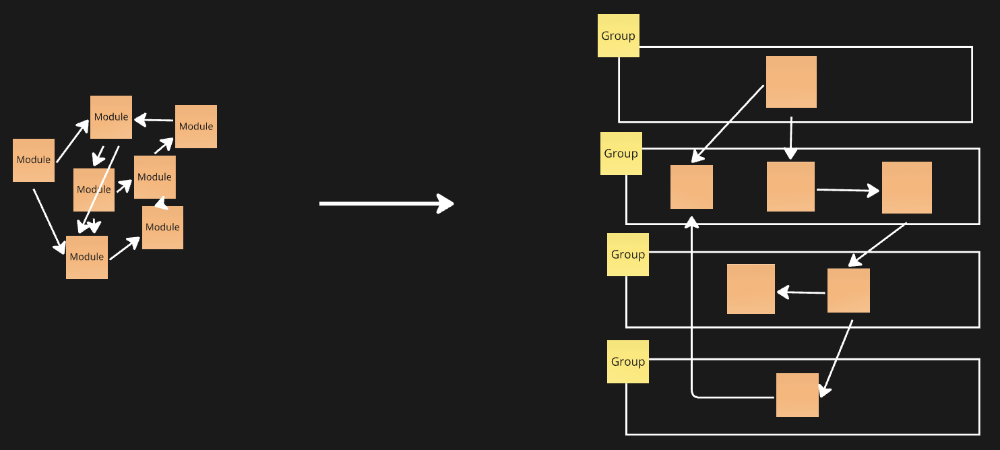

# Architectural patterns

Использовать папочку components? или лучше ui и model?
Паттерны отвечающие на вопросы: "Куда положить это?".

- [Module](#module) _(скрывает сложность)_
- [Group](#group) _(помогает найти нужный модуль)_

## Module

_(скрывает сложность)_

**Проблема**

- В приложении становится так много кода, что его невозможно полность понять

**Решение**

- Разделить код на слабо связанные модули, так, чтобы каждый модуль имел высокую смысловую связанность. Каждый модуль имеет public API, с которым работают другие модули. Модуль создает абстракцию

**Преимущества и недостатки**

- ✅ Позволяет абстрагироваться от внутренней сложности модулей
- ✅ Позволяет работать с один модулем, не думая о других
- ❌ Сложно определить границы модуля
- ❌ Как выстраивать взаимодействие между модулями?

**Заметки**

- В разных модулях могут быть разные куски типов одной сущности с бека (bounded context)
- Разделение идет не по технической принадлежности, а на основании смысловой связанности

---

&nbsp;

## Group

_(помогает найти нужный модуль)_

**Проблема**

- Модулей становится так много, что в них сложно ориентироваться. Чтобы найти нужный модуль, нужно знать что лежит в каждом модуле.

**Решение**

- Выделить модули по группам, по общим признакам

**Преимущества и недостатки**

- ✅ Упрощает навигацию по проекту
- ✅ Упрощает выделение новых модулей
- ✅ Позволяет создавать "арзитектурные границы"
- ❌ Иногда модуль разрывается между двумя группами
- ❌ Сложно придумать группы, которые обеспечивают выделение оптимальных модулей

**Заметки**

- Public API групп - антипаттерн
- Готовые группы - MVC, MVP, MVVM, FSD, DDD, Clean Arhitecture
