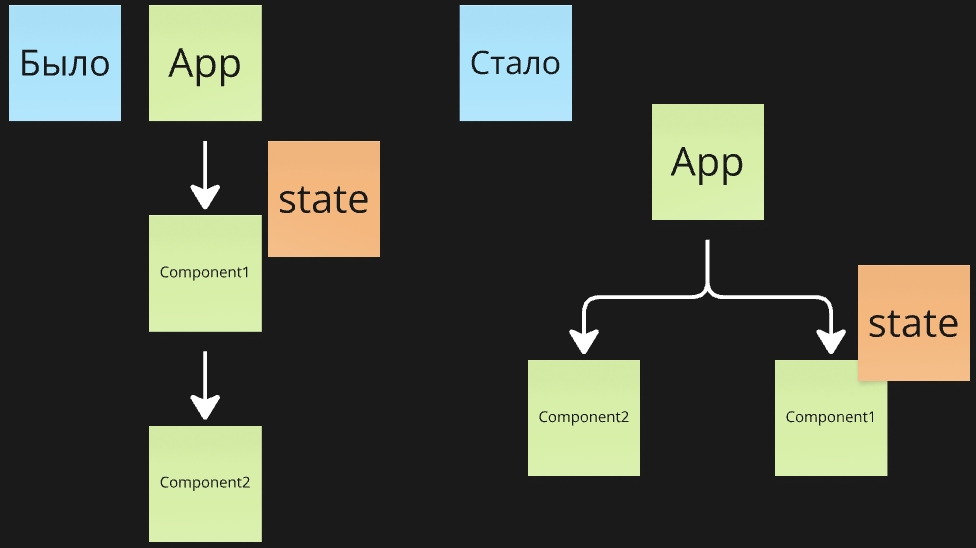
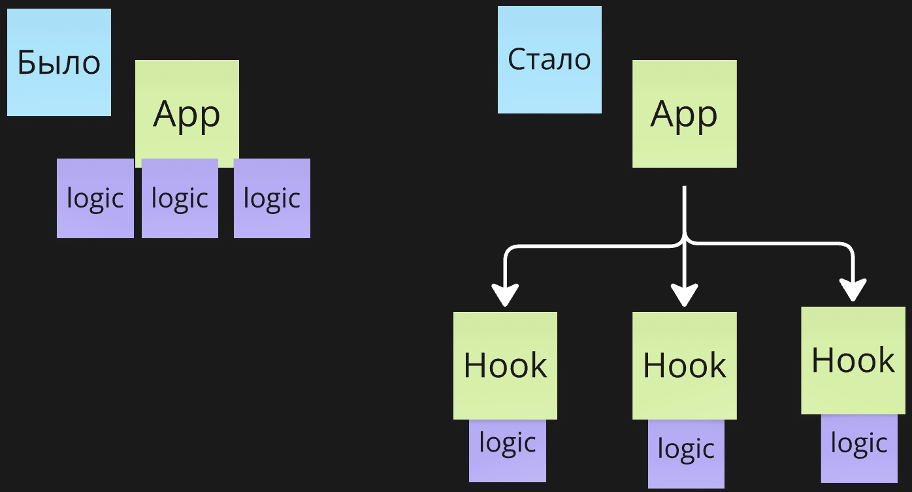
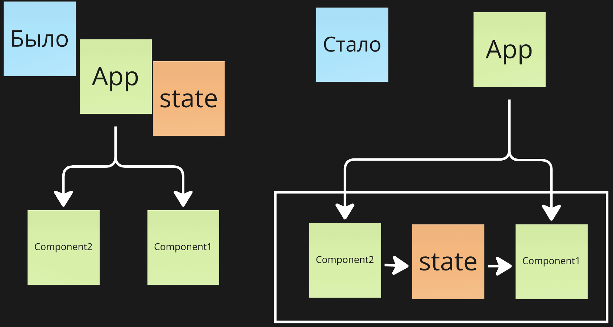
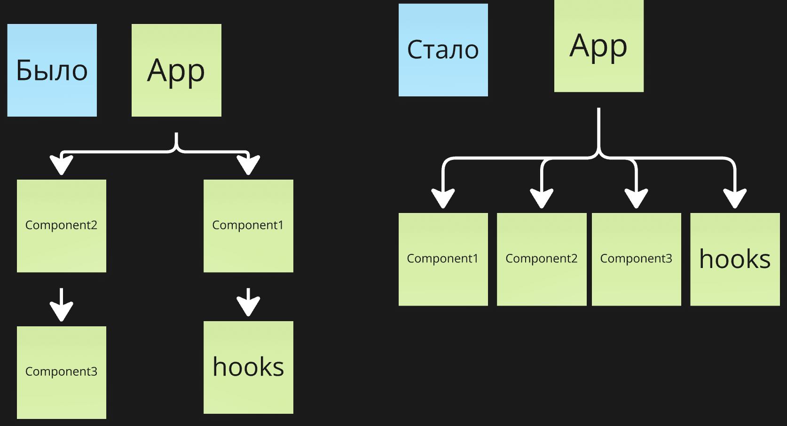
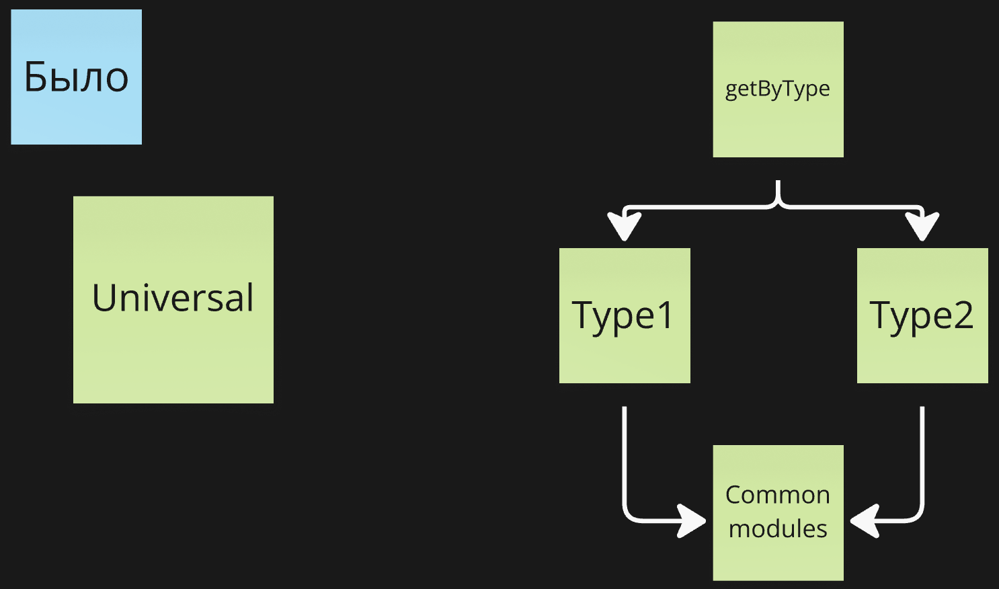
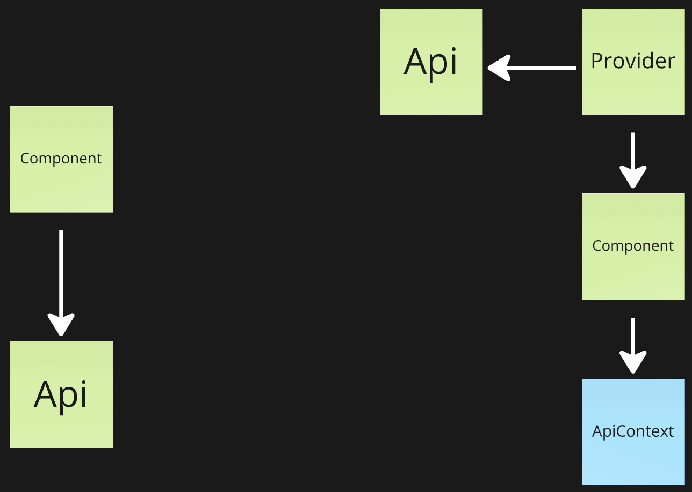

# Decomposition patterns

Разделил компоненты на несколько и стало только хуже?
Паттерны декомпозиции кода, которые позволяют достигать [Low coupling/High cochesion](https://habr.com/ru/companies/otus/articles/505852/).

- [Slot](#slot) _(props drilling, god object)_
- [Render props](#render-props) _(props drilling, god object)_
- [Hooks flow](#hooks-flow) _(god object)_
- [Local global states](#local-global-states) _(god object)_
- [Mediator](#mediator) _(урощает логику связей между компонентами)_
- [Polymorphism](#polymorphism) _(упрощает ветвление логики)_
- [Contextual DI](#contextual-di) _(god object)_

## Slot

_(props drilling, god object)_

**Проблема**

- У компонента слишком много ответственностей

**Решение**

- Можно делегировать отрисовку части компонентов родителю и получить их через пропсы

**Преимущества и недостатки**

- ✅ Решает проблему пропс дриллинга
- ✅ Увеличивает переиспользование
- ❌ Блокирует React.memo
- ❌ Плоховато читается

**Заметки**

- Не стоит сильно дробить, чтобы не создать бесполезные компоненты

---

&nbsp;

## Render props

_(props drilling, god object)_

Усложненная версия паттерна [Slot](#slot). Отличие - передается не ReactNode, а функция, которая возвращает ноду: () => ReactNode. Как именно отрисовывается определяет внешний код, но появляется возможность повлиять на отрисовку внутренним состоянием компонента.

**Проблема**

- У компонента слишком много ответственностей, но использование [Slot](#slot) невозможно, так как дочерние компоненты зависят от локального состояния

**Решение**

- Принимается не сам React элемент, а стратегия его отрисовки (() => ReactNode), в которую компонент, который отрисосвывает этот элемент, может прокинуть параметры

**Преимущества и недостатки**

- ✅ Решает проблему пропс дриллинга
- ✅ Увеличивает переиспользование
- ✅ Позволяет инкапсулировать состояние
- ❌ Блокирует React.memo
- ❌ Плоховато читается

---

&nbsp;

## Hooks flow

_(god object)_

**Проблема**

- Не получается разделить логику на хуки, так как логика работает с общими данными

**Решение**

- Данные могут перетекать из хука в хук, пока не попадут в компонент. Каждый хук отвечает за свою часть преобразования данных

**Преимущества и недостатки**

- ✅ Инкапсуляция логики
- ❌ Сложно составить общую картину

---

&nbsp;

## Local global states

_(god object)_

**Проблема**

- В результате декомпозиции двум компоненам/хукам нужен доступ к состоянию, но это состояние не нужно внешнему коду - из-за ограничений реакта необходимо вынести состояние за перделы компонента, чтобы иметь возможность их связать

**Решение**

- Сделать контекст (модуль стейт менеджера) локальным для этих компонентов

**Преимущества и недостатки**

- ✅ Сокрытие подробностей
- ✅ Увеличивает надежность (у внешнего кода нет доступа к большому количеству пропсов)
- ❌ Провайдеры

---

&nbsp;

## Mediator

_(урощает логику связей между компонентами)_

**Проблема**

- Связи между компонентами размазаны по системе, и их сложно отследить

**Решение**

- Создать компонент/хук/фукнцию "медиатор", которые связывают другие компоненты вместе

**Преимущества и недостатки**

- ✅ Отделение связей в отдельный модуль - делает связи проще для понимания
- ✅ Минимизирует связи модулей напрямую - увеличивает их надежность
- ❌ Модули больше не могут взаимодействовать напрямую

---

&nbsp;

## Polymorphism

_(упрощает ветвление логики)_

**Проблема**

- Много условной логики в зависимости от типа

**Решение**

- Инкапсулировать всю логику "в зависимости от типа" в один компонент. Изменение логики происходит за счет выбора компонента

**Преимущества и недостатки**

- ✅ Уменьшение условной логики
- ✅ Легко добавлять новый тип
- ❌ Часть кода дублируется
- ❌ Массовая доработка типов

---

&nbsp;

## Contextual DI

_(god object)_

**Проблема**

- Прямая зависимость на инфраструктуру ограничивает переиспользуемость + осложняет тестирование

**Решение**

- Использовать окнтекст для внедрения зависимостей

**Преимущества и недостатки**

- ✅ Увеличивает гибкость и надежность
- ✅ Тестируемость
- ❌ Сложно понять, какая сейчас реализация