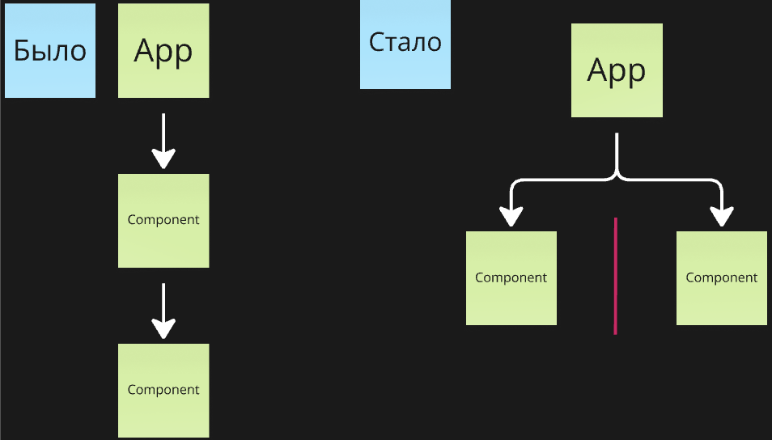

# Decomposition patterns

Разделил компоненты на несколько и стало только хуже?
Паттерны декомпозиции кода, которые позволяют достигать [Low coupling/High cochesion](https://habr.com/ru/companies/otus/articles/505852/).

- [Slot](#slot) _(props drilling, god object)_

## Slot

_(props drilling, god object)_

**Проблема**

- У компонента слишком много ответственностей

**Решение**

- Можно делегировать отрисовку части компонентов родителю и получить их через пропсы

**Преимущества и недостатки**

- ✅ Решает проблему пропс дриллинга
- ✅ Увеличивает переиспользование
- ❌ Блокирует React.memo
- ❌ Плоховато читается

**Заметки**

- Не стоит сильно дробить, чтобы не создать бесполезные компоненты
